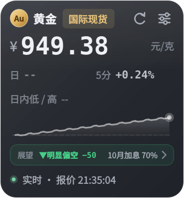
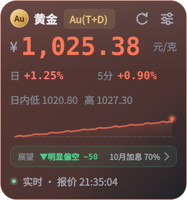
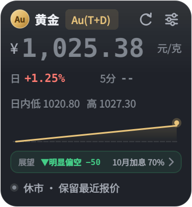
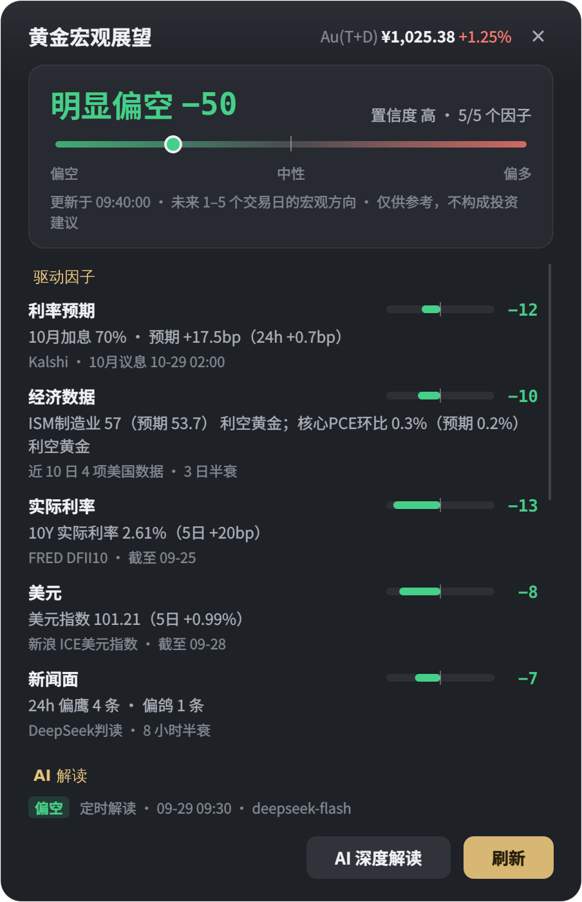
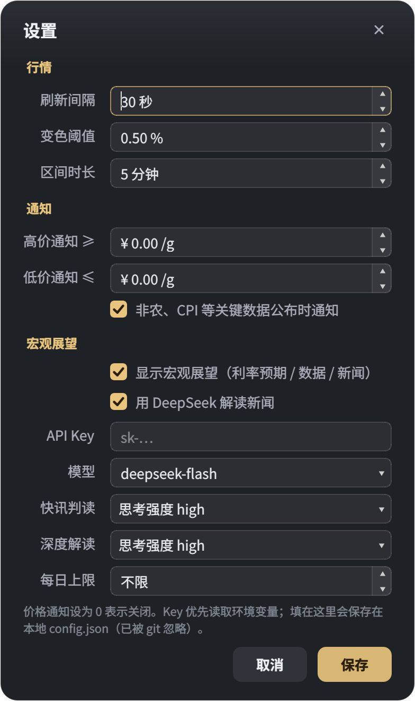
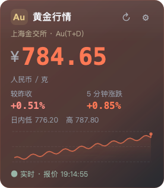
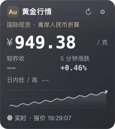
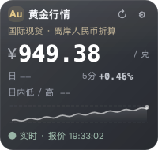

# GoldMonitor

实时黄金价格桌面悬浮窗。行情按交易时间在上海金交所 Au(T+D) 与国际现货金价之间自动切换；另有一个「宏观展望」模块，根据美联储利率预期、美国经济数据、实际利率、美元和新闻，给出黄金未来 1–5 个交易日的方向判断。

  

## 界面预览

悬浮窗尺寸为 **188 × 202**。下面是同一个面板的三种状态，运行时只显示一个。截图使用示例数据，不代表实时行情。

| 国际现货 | 国内 Au(T+D) | 休市 |
|:---:|:---:|:---:|
|  |  |  |

点击底部的「展望」条，悬浮窗会以弹簧曲线形变为宏观展望面板，关闭时再收回原处：

<p align="center"></p>

| 宏观展望 | 设置 |
|:---:|:---:|
|  |  |

<details>
<summary>查看尺寸调整过程中的效果图</summary>

从最初的展开布局逐步收紧留白、合并信息行。下图是早期调整过程中的三个版本。

| 初版布局 · 276 × 316 | 收紧布局 · 236 × 264 | 恢复原尺寸 · 200 × 190 |
|:---:|:---:|:---:|
|  |  |  |

</details>

## 功能

**行情**
- 半透明圆角悬浮窗，始终置顶，可拖拽，靠近屏幕边缘自动吸附收边
- 人民币/克参考价，标题旁标签显示当前来源（Au(T+D) / 国际现货）
- 较昨收涨跌幅、可配置区间的涨跌幅、日内高低
- 走势图按所选时长展示同一数据源，虚线标出区间起点，断档不连线
- 区间涨跌超过阈值时，背景、边框和曲线联动变色（红涨绿跌）
- 休市、更新失败、报价过期时保留最近报价并弱化显示
- 价格突破阈值时发送系统通知（异步，不阻塞界面）

**宏观展望**
- 一行展望条：多空结论、总分（−100 ~ +100）和最关键的驱动，例如「▼偏空 −38 · 10月加息 70%」
- 详情面板：五个因子的得分拆解、AI 解读、未来一周重要数据与 FOMC 倒计时、相关快讯（可点击打开原文）
- 打开时悬浮窗从所在角落弹性展开成面板（向屏幕中心方向生长），关闭或按 Esc 时收回；面板标题栏同步显示实时金价
- 非农、CPI、PCE 等关键数据公布前后自动加快刷新，数据一出就重新评分，并可弹系统通知
- 可选 DeepSeek 解读：逐条判断快讯的鹰鸽倾向，并在关键时刻生成综合解读

**其他**
- 最近 1 小时运行日志（只记录状态变化，不刷屏）
- 系统托盘：显示/隐藏、宏观展望、日志、设置、刷新
- 跨平台（macOS / Windows / Linux）

## 快速开始

```bash
pip install -r requirements.txt
export DEEPSEEK_API_KEY=sk-...   # 可选：开启 AI 解读
python main.py
```

不配置 DeepSeek 也能正常使用，新闻倾向会改用内置的规则词典判断。

## 使用方法

- **拖拽移动**：左键按住窗口拖动，靠近边缘松开可自动贴边收起
- **贴边展开**：鼠标移到边缘露出的细条上，悬浮窗会自动滑出
- **宏观展望**：点击展望条；面板里的「AI 深度解读」可以立即生成一次解读
- **右键菜单 / 系统托盘**：宏观展望 / 日志 / 设置 / 刷新 / 退出

## 设置项

| 设置 | 默认值 | 说明 |
|------|--------|------|
| 刷新间隔 | 30 秒 | 行情更新频率 |
| 变色阈值 | 0.5% | 区间涨跌达到此值后开始增强配色 |
| 区间时长 | 5 分钟 | 对比该时段内的价格变化 |
| 高价 / 低价通知 | 0（关闭） | 金价 ≥ / ≤ 此值时发送通知 |
| 关键数据通知 | 开 | 非农、CPI 等公布时通知实际值、预期值和对黄金的影响方向 |
| 显示宏观展望 | 开 | 关闭后不再请求宏观数据，悬浮窗高度相应缩短 |
| DeepSeek 解读 | 开 | 需要 API Key；没有 Key 时自动使用规则词典 |
| 模型 | deepseek-flash | 可改为 deepseek-v4-pro 或手动输入 |
| 快讯判读 / 深度解读 | 思考强度 high | 可选关闭思考、low、high、max，两档分别设置 |
| 每日上限 | 不限 | 每日 token 上限，超出后当天改用规则词典 |

API Key 优先读取环境变量 `DEEPSEEK_API_KEY`；在设置里填写的 Key 保存在本地 `config.json`（已被 git 忽略）。

## 宏观展望怎么算

总分 = 100 × Σ(权重 × 因子信号)。每个因子的信号在 −1 到 +1 之间，正数表示利多黄金。某个因子的数据源都不可用时按 0 计，同时降低置信度。

| 因子 | 权重 | 看什么 | 信号方向 |
|------|------|--------|----------|
| 利率预期 | 35% | 下次 FOMC 会议的加息/降息概率。概率来自预测市场（用真金白银押注结果的市场，价格约等于概率），算出预期变动的基点数，以及它 24 小时内的变化 | 预期越偏加息、或加息预期在升温，越偏空 |
| 经济数据 | 25% | 近 10 天美国关键数据的「意外值」（公布值 − 市场预期），按指标的典型波动幅度标准化，3 天半衰 | 就业、通胀强于预期（更可能加息）偏空；失业率、初请高于预期偏多 |
| 实际利率 | 15% | 10 年期 TIPS 收益率（扣除通胀后的利率）5 个交易日的变化 | 上行偏空 |
| 美元 | 10% | ICE 美元指数 5 个交易日的涨跌幅 | 走强偏空 |
| 新闻面 | 15% | 过去 24 小时与美联储、利率、黄金相关的快讯，逐条判断鹰（利空）/ 鸽（利多），8 小时半衰 | 鸽派居多偏多 |

- **结论**：≥ 15 为偏多，≥ 40 为明显偏多，偏空对称，其余为中性。
- **置信度**：由可用因子的权重覆盖率和各因子方向是否一致决定，分为高、中、低。
- **刷新节奏**：平时 5 分钟一次；所有金价市场都休市时（周末、每日休市）放慢到 30 分钟，开盘时恢复。关键数据公布前会对准公布时刻，公布后 15 分钟内每 30 秒拉取一次，直到拿到实际值。美元指数最多缓存 15 分钟，FRED 利率数据缓存 1 小时。
- **AI 的作用**：只做两件事，判断新快讯的鹰鸽倾向和生成综合解读。数据意外值、概率这些数字都在本地计算。
  - 每条快讯只发送一次，结果缓存在 `ai_cache.json`，重启后不会重复分析。
  - 每批最多 10 条，每条截断到 200 字；两次判读至少间隔 3 分钟。
  - 综合解读在以下情况生成：关键数据公布（与上次解读至少间隔 5 分钟，赶上冷却或 AI 忙会顺延，不会丢）；利率预期比上次解读时变化 ≥ 5bp；评分比上次解读变化 ≥ 20 分，或多空翻转且变化 ≥ 8 分；开市期间距上次解读超过 8 小时；手动请求（间隔 60 秒）。除数据公布和手动请求外，自动触发至少间隔 30 分钟。
  - 模型调用在独立后台线程里进行，界面先显示规则结果，AI 结果回来后再更新。

以上是基于公开数据的规则打分，仅供参考，不构成投资建议。

## 数据来源

**行情**
- 招商银行黄金行情 API（上海金交所 Au(T+D)）：北京时间周一至周五 9:00-11:30、13:30-15:30、19:50-次日 2:30；周五夜盘延续至周六 2:30。
- Swissquote XAU/USD 与 USD/CNH：瑞士时间周一至周五 00:05-22:55，程序通过 `Europe/Zurich` 时区自动处理夏令时。

程序只使用当前处于交易时段、且接口时间戳仍新鲜的报价。Au(T+D) 时段优先使用招行，休市后自动使用国际源；节假日或接口异常时按报价有效性回退。国际源通过 XAU/USD 与 USD/CNH 换算参考价，不使用 Au(T+D) 的昨收价计算日涨跌。两种来源的历史分别保存，避免切换时产生虚假区间涨跌。超过 180 秒的报价标记为过期。

**宏观**（每个因子按顺序尝试，前一个不可用时自动换下一个；异常会显示在展望面板底部）

| 用途 | 数据源 |
|------|--------|
| 利率预期 | Kalshi → Polymarket → 华尔街见闻快讯中转述的 CME FedWatch 概率 |
| 经济数据与日历 | 华尔街见闻财经日历（含公布值与预期值）→ Forex Factory 周历（只有日程） |
| 实际利率 | FRED `DFII10`（10 年期 TIPS）→ FRED `DGS10`；日频，约晚 1 个交易日 |
| 美元 | 新浪财经 ICE 美元指数日 K |
| 新闻 | 华尔街见闻黄金频道快讯 + 「美联储」搜索结果 |
| FOMC 日程 | 美联储官网公布的 2026–2027 年会议日期（内置） |

## 维护与验证

```bash
QT_QPA_PLATFORM=offscreen python3 -m unittest discover -v
```

Windows PowerShell 可先执行 `$env:QT_QPA_PLATFORM="offscreen"`，再运行 `python -m unittest discover -v`。

测试共 143 个，覆盖行情校验与来源切换、贴边吸附、展开/收回过渡、各数据源的解析与回退、因子打分、事件日程、AI 调用的缓存/限频/失败回退、配置和日志损坏恢复，不访问网络、不发送系统通知。

| 文件 | 职责 |
|------|------|
| `main.py` | 悬浮窗：组装界面、调度行情与宏观刷新、通知 |
| `dock.py` | 贴边吸附与滑出 |
| `morph.py` | 悬浮窗与面板之间的弹性形变过渡 |
| `widgets.py` / `chart.py` / `theme.py` | 矢量图标、展望条、走势图，统一配色与字体 |
| `api.py` / `price_history.py` | 行情获取、交易时间、报价校验；按来源隔离的历史 |
| `macro_sources.py` | 宏观数据源的抓取与解析 |
| `outlook.py` | 因子打分、事件日程、刷新节奏、AI 任务规划 |
| `news_ai.py` | DeepSeek 调用、缓存与用量统计 |
| `outlook_panel.py` / `settings.py` / `logs.py` / `glass.py` | 展望面板、设置、日志与对话框基类 |
| `notifications.py` / `workers.py` | 异步系统通知；后台任务线程 |

## 依赖

- Python 3.9+
- PyQt6
- requests
- tzdata（Windows 时区数据库）
